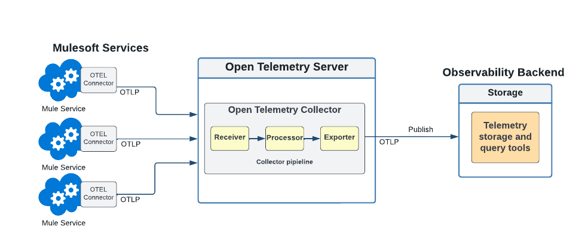
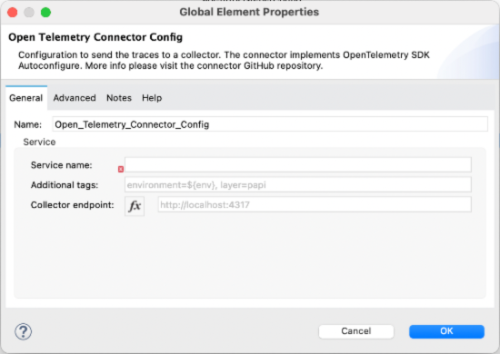
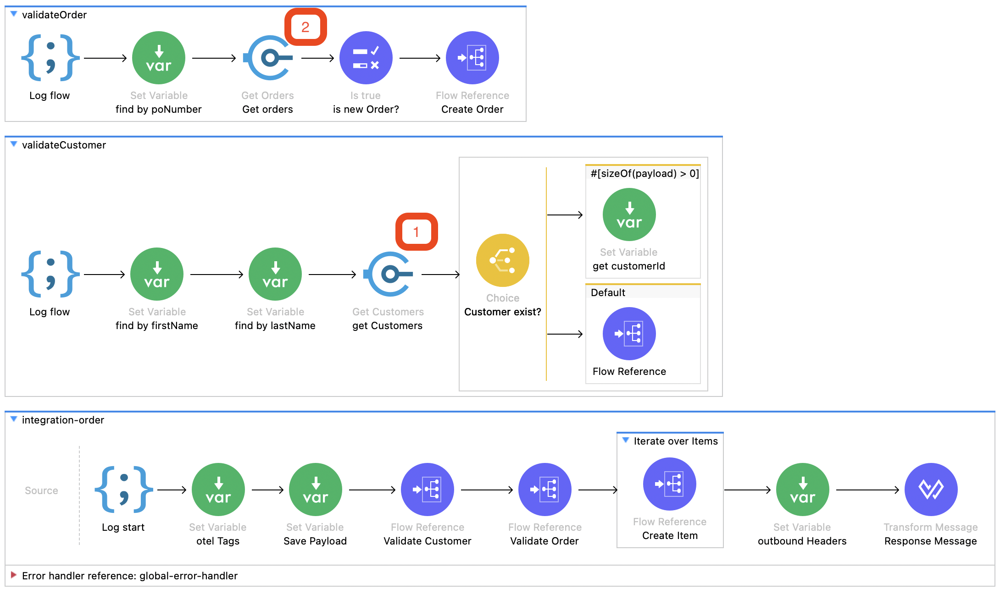
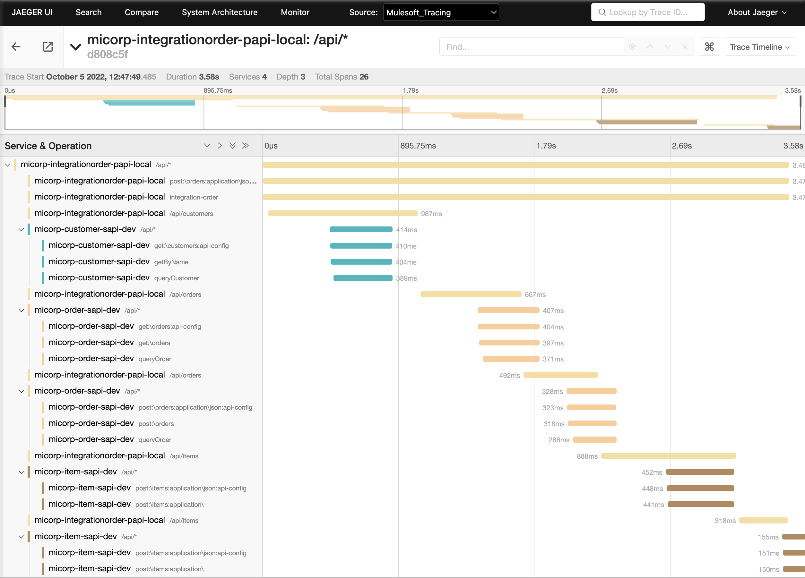
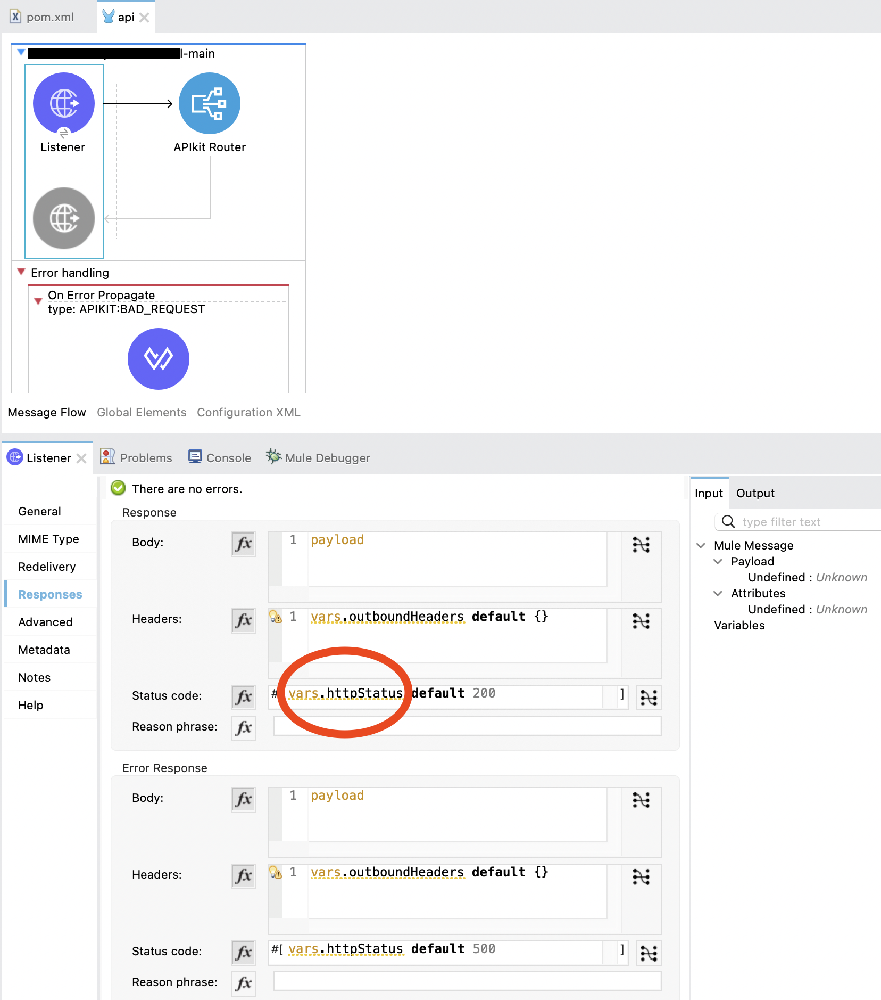
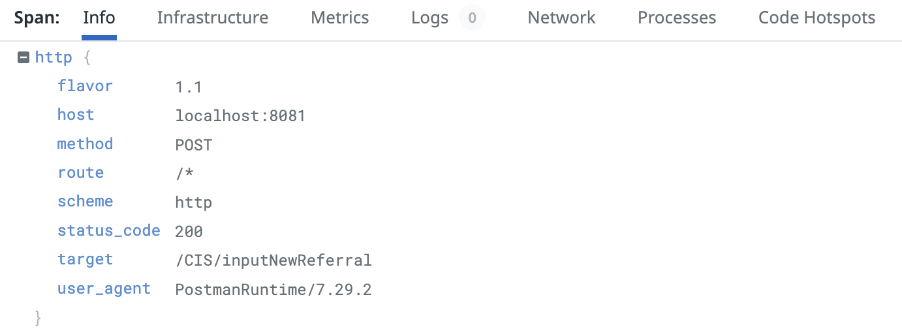

# Mulesoft OpenTelemetry Connector

Mulesoft connector that allows a service to participate or initiate a transaction with the standard library Open Telemetry

**Table of content**
1. [Introduction](#introduction)
2. [Architecture](#architecture)
3. [Configuration](#configuration)
    1. [Debugging applications in local environment](#debugging-applications-in-local-environments)
       1. [Sending traces to a local Jaeger](#sending-traces-to-a-local-jaeger)
       2. [Sending traces to the log](#sending-traces-to-the-log)
    2. [Additional configuration](#additional-configuration)
4. [Using the connector](#using-the-connector)
    1. [Add custom tags](#add-custom-tags)
       1. [Environment tags](#environment-tags)
       2. [Runtime tags](#runtime-tags)
    2. [Retrieving the current span during a flow](#retrieving-the-current-span-during-a-flow)
    3. [Getting the status code for the service](#getting-the-status-code-for-the-service)
5. [Debugging the connector](#debugging-the-connector)
6. [Available tags in traces](#available-tags-in-traces)
   1. [Host](#host)
   2. [Process](#process)
   3. [OS](#os)
   4. [Telemetry](#telemetry)
   5. [Http](#http)
   6. [Mule](#mule)
7. [Compile](#compile)

# Introduction

The connector implements the OpenTelemetry standard to instrument, generate, collect, and export telemetry data (metrics, logs, and traces) to help you analyze your software’s performance and behavior [https://opentelemetry.io/](https://opentelemetry.io/). This project uses the OpenTelemetry Java SDK [https://github.com/open-telemetry/opentelemetry-java](https://github.com/open-telemetry/opentelemetry-java)

# Architecture

The connector follows a minimalistic approach that helps to implement the following architecture with the default values



Architecture diagram

The connector will send the telemetry data using the otlp protocol to an open telemetry collector, that is responsible to collect all inputs from the services, process them and export the data to an observability backend like Jaeger for example.

# Configuration

The connector offers configuration windows where We can set the most important parameters




Configuration window

| Parameter | Description |
| --- | --- |
| Service name | The name of the service that is used to name the traces. Example: salesforce-customer-sapi. This value is connected with the environment variable: OTEL_SERVICE_NAME, which is described in the SDK documentation |
| Additional tags | Specify resource attributes in the following format: key1=val1,key2=val2,key3=val3. Example: layer=sapi, environment:local. This value is connected with the environment variable: OTEL_RESOURCE_ATTRIBUTES, which is described in the SDK documentation |
| Collector endpoint | The OTLP traces endpoint to connect to. Must be a URL with a scheme of either http or https based on the use of TLS. The default is http://localhost:4317 when the protocol is grpc, and http://localhost:4318/v1/traces when the protocol is http/protobuf. The value is connected with the environment variable: OTEL_EXPORTER_OTLP_TRACES_ENDPOINT, which is described in the SDK documentation |

Beyond the standard configuration described above, the connector is highly configurable using system properties or environment variables, and all of them are described in the SDK documentation, links:

- [OpenTelemetry SDK Auto-configure](https://github.com/open-telemetry/opentelemetry-java/blob/main/sdk-extensions/autoconfigure/README.md)
- [OpenTelemetry Environment Variable Specification](https://opentelemetry.io/docs/reference/specification/sdk-environment-variables/)

For more specific configuration about the exporter, follow the next link: [Exporter](https://github.com/open-telemetry/opentelemetry-specification/blob/main/specification/protocol/exporter.md)

Configuration example of the connector in the mule configuration file like global.xml:

```xml
<open-telemetry:config 
	name="Open_Telemetry_Connector_Config" 
	doc:name="Open Telemetry Connector Config" 
	doc:id="5c85f8ab-75c8-45b2-b93d-311337bc24bf" 
	serviceName="${deployment.name}" 
	additionalTags="environment=${env}, layer=papi" 
	collectorEndpoint="${otel.collectorendpoint}"
	doc:description="Using the standard configuration.&#10;&#10;Overriding the collector endpoint.">
</open-telemetry:config>
```

Injection of properties example:

```bash
-M-Ddeployment.name=micorp-integrationorder-papi
-M-Denv=local 
-M-Dotel.collectorendpoint=http://22.52.172.177:4317
```

## Debugging applications in local environments

### Sending traces to a local Jaeger

By default, the connector will send the traces to localhost:4317, we can run the Jaeger server in all-in-one mode. Different configurations can be found in the official documentation [https://www.jaegertracing.io/docs/1.38/getting-started/](https://www.jaegertracing.io/docs/1.38/getting-started/). We enable the property --collector.otlp.enabled=true to receive the trace data in otlp format

Jaeger on local

```bash
./jaeger-all-in-one --collector.otlp.enabled=true
```

For the connector configuration, there is no need to configure the collectorEndpoint property

```xml
<open-telemetry:config 
  name="Open_Telemetry_Connector_Config" 
  doc:name="Open Telemetry Connector Config" 
  doc:id="5c85f8ab-75c8-45b2-b93d-311337bc24bf" 
  serviceName="${deployment.name}" 
  additionalTags="environment=${env}, layer=papi" 
  doc:description="Using the standard configuration.&#10;&#10;Overriding the collector endpoint.">
</open-telemetry:config>
```

### Sending traces to the log

To send the traces to the log we configure the connector with default values


```xml
<open-telemetry:config 
  name="Open_Telemetry_Connector_Config" 
  doc:name="Open Telemetry Connector Config" 
  doc:id="5c85f8ab-75c8-45b2-b93d-311337bc24bf">
</open-telemetry:config>
```

Start the mule engine with the next property

```bash
-M-Dotel.traces.exporter=logging
```

## Additional configuration

The next properties are not specific to the [OpenTelemetry SDK](https://github.com/open-telemetry/opentelemetry-java/blob/main/sdk-extensions/autoconfigure/README.md), but control the behavior of the connector

**System Properties**

| Property | Description |
| --- | --- |
| otel.mule.enabletracing | Enable or disables the tracing library. Default value true |

# Using the connector

By default, the connector will generate traces for every flow in your service and will pass automatically the span data to any service call that was imported from Anypoint Exchange. In the next example, Get Orders (number 2) and Get Customers (number 1) calls will propagate trace data to the child services.



Mule flow example

The complete trace data in the Observability Backend:



Traces example in Jaeger

## Add custom tags

### Environment tags

We can add tags to the traces related to environment variables, for example, environment name, name of the container, cloud region, instance number, etc. See in the configuration section of this document the parameter: Additional tags

### Runtime tags

In every flow, we can create custom tags for the trace, helping us to query traces using this data in the observability backend. In the next example, we added a custom tag at the beginning of the flow with the product number (poNumber)= 123604. The tag is sent with the telemetry data that later We use to query the traces. The process to add the tags to the flow is by setting the process variable `openTelemetryTags`

Example, business flow:


Example, setting business data on tags

Code for “Set Variable” operation. Setting variable:`openTelemetryTags`

```java
%dw 2.0
output application/java
---
{
  "poNumber": payload.orderData.poNumber default "",
  "firstName": payload.customer.firstName default ""
}
```

In the observability backend query by tag example:


Example, querying business data on tags

The search will give us all the traces with the tag query criteria. In the next image


Example, querying business data on tags results

## Retrieving the current span during a flow

The current span data can be retrieved by inspecting the value of the process variable `openTelemtryTrace`.  This data can be useful to send manually the current span to other services or connectors.

## Getting the status code for the service

By default, the connector uses the standard variable `httpStatus` to get the response from the service, for example:



Setting the httpStatus variable example

# Debugging the connector

To show the connector logs with debug level, add the next logger to log4j2.xml:

```xml

<AsyncLogger name="com.mulesoft.ot" level="DEBUG"/>
```

Available levels: INFO, DEBUG, TRACE

# Available tags in traces

Next is the list of the available tags that are included in the tracing.

## Host

A host is defined as a general computing instance.

| Attribute | Description |
| --- | --- |
| host.arch | The CPU architecture the host system is running on. |
| host.name | Name of the host. On Unix systems, it may contain what the hostname command returns, or the fully qualified hostname, or another name specified by the user. |

[*Open Telemetry Specification*](https://github.com/open-telemetry/opentelemetry-specification/blob/main/specification/resource/semantic_conventions/host.md)

## ****Process****

An operating system process

| Attribute | Description |
| --- | --- |
| process.command_line | The full command used to launch the process as a single string representing the full command. On Windows, can be set to the result of GetCommandLineW. Do not set this if you have to assemble it just for monitoring; use process.command_args instead. |
| process.executable.path | The full path to the process executable. On Linux based systems, can be set to the target of proc/[pid]/exe. On Windows, can be set to the result of GetProcessImageFileNameW. |
| process.pid | Process identifier (PID). |
| process.runtime.name | The name of the runtime of this process. For compiled native binaries, this SHOULD be the name of the compiler. |
| process.runtime.version | The version of the runtime of this process, as returned by the runtime without modification. |
| process.runtime.description | An additional description about the runtime of the process, for example a specific vendor customization of the runtime environment. |

[*Open Telemetry Specification*](https://github.com/open-telemetry/opentelemetry-specification/blob/main/specification/resource/semantic_conventions/process.md)

## OS

The operating system (OS) on which the process represented by this resource is running. In case of virtualized environments, this is the operating system as it is observed by the process, i.e., the virtualized guest rather than the underlying host.

| Attribute | Description |
| --- | --- |
| os.description | Human readable (not intended to be parsed) OS version information, like e.g. reported by ver or lsb_release -a commands. |
| os.type | The operating system type. |

*[Open Telemetry Specification](https://github.com/open-telemetry/opentelemetry-specification/blob/main/specification/resource/semantic_conventions/os.md)*

## TELEMETRY

The telemetry SDK used to capture data recorded by the instrumentation libraries.

| Attribute | Description |
| --- | --- |
| telemetry.sdk.name | The name of the telemetry SDK as defined above. |
| telemetry.sdk.language | The language of the telemetry SDK. |
| telemetry.sdk.version | The version string of the telemetry SDK. |

*[Open Telemetry Specification](https://opentelemetry.io/docs/reference/specification/resource/semantic_conventions/)*

## HTTP

The HTTP request, response, and headers tags

| Attribute | Description |
| --- | --- |
| http.flavor | Kind of HTTP protocol used |
| http.host | Logical local hostname or similar, see note below |
| http.method | HTTP request method |
| http.route | The matched route (path template in the format used by the respective server framework) |
| http.scheme | The URI scheme identifying the used protocol. |
| http.status_code | HTTP response status code |
| http.target | The full request target as passed in a HTTP request line or equivalent |
| http.user_agent | Value of the HTTP User-Agent header sent by the client. https://www.rfc-editor.org/rfc/rfc9110.html#field.user-agent |
| http.request_content_length | The size of the request payload body in bytes |
| http.content_type | Format type of the request payload |

Java Semantic Definition: [https://github.com/open-telemetry/opentelemetry-java/blob/main/semconv/src/main/java/io/opentelemetry/semconv/trace/attributes/SemanticAttributes.java](https://github.com/open-telemetry/opentelemetry-java/blob/main/semconv/src/main/java/io/opentelemetry/semconv/trace/attributes/SemanticAttributes.java)

Example:



Http tags example

## MULE

MULE service metadata

| Attribute | Description | Runtime value |
| --- | --- | --- |
| mule.serverId | Server Id | EnrichedServerNotification.getServerId() |
| mule.service.flow.name | The resourceIdentifier is used when firing inbound server notifications such as Admin notifications or other action notifications triggered by an external source Used to associate the event with a particular resource. | EnrichedServerNotification.getResourceIdentifier() |

**SOURCE**. Metadata about the source component which originates the flow. The runtime value is taken from:

```
ComponentIdentifier sourceIdentifier = enrichedServerNotification
																				.getEvent()
																				.getContext()
																				.getOriginatingLocation()
																				.getComponentIdentifier()
																				.getIdentifier();
```

Attributes

| Attribute | Description | Example |
| --- | --- | --- |
| mule.service.flow.source.configRef | Configuration reference | HTTP_Listener_configuration |
| mule.service.flow.source.name | Name of the component | listener |
| mule.service.flow.source.namespace | Namespace | http |

In the next image the listener component is the source:


**PROCESSOR**. Metadata about the component that creates a new span. The runtime value is taken from:

```
org.mule.runtime.api.component.ComponentIdentifier =
			enrichedServerNotification.getComponent().getIdentifier().getName()
```

Attributes

| Attribute | Description | Runtime value |
| --- | --- | --- |
| mule.service.processor.name | Connector name | request |
| mule.service.processor.namespace | Namespace | http |
| mule.service.processor.docname | XML attribute value for doc:name | errorWriter request |
|  mule.service.processor.configRef | Configuration reference | HTTP_Request_configuration |

# Compile

To compile and deploy the connector to your Anypoint Exchange run in your terminal:

```bash
mvn deploy
```

The project includes a code format plugin: `spotless-maven-plugin` This plugin follows the eclipse format rules and the documentation can be found [here](https://github.com/diffplug/spotless/tree/main/plugin-maven). When the code has format errors, those can be fixed by running:

```xml
mvn spotless:apply
```

Increase the version number in pom.xml

```xml
<version>1.0.41</version>
```

Update the version in constant LIBRARY_VERSION in java class: `Constants.java`. This value

```java
public static final String LIBRARY_VERSION = "1.0.41";
```